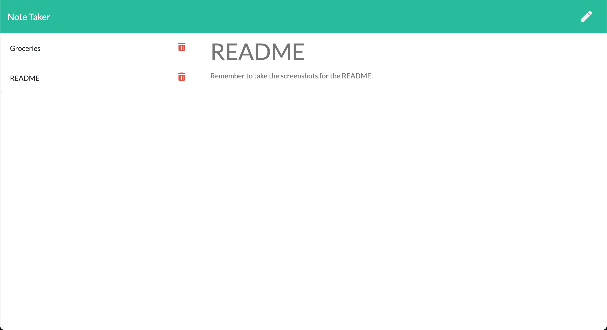
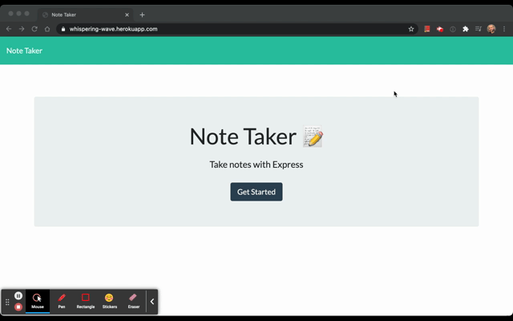

# note-taker

## Description
    A note taking application using Express.js for the back end, saves and retrieves note data from a JSON file. The application is deployed to Heroku.

## Screenshots
   

## Usage
    Visit the application's page and click "Get Started",  
    click on Note Title and enter a title,  
    click on the Note Text and enter some text,  
    click the save icon on the top right to save note.  
    Click the delete icon to remove a note.

   

## Link
   [Link to site](https://whispering-wave.herokuapp.com/)

## License
   [MIT License](https://opensource.org/licenses/MIT)